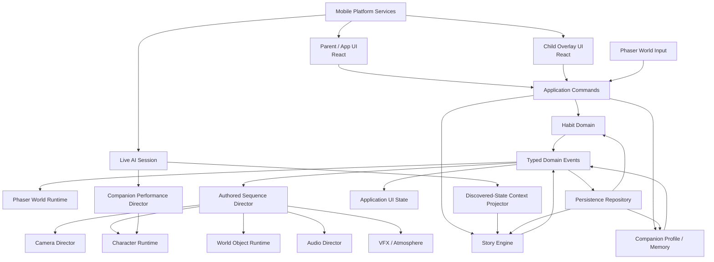

# KidsHabits — Product Architecture Proposal v1

**Status:** Proposal for review  
**Target:** Production-capable architecture for 30-day planets, starting with Sprout Planet  
**Engine:** Phaser 4 clean start  
**Primary platform:** Mobile portrait  
**Source of truth:** `project/PRODUCT_VISION.md`

---

## 1. Executive decision

KidsHabits should be built as a **mobile application containing a Phaser 4 living-world runtime**, not as one giant Phaser application and not as a set of static illustrated screens.

The architecture should deliberately separate:

- parent / application UX,
- habit authority,
- deterministic story state,
- world rendering,
- authored sequence direction,
- character performance,
- live AI conversation,
- audio,
- persistence,
- native mobile capabilities,
- content authoring and QA.

The most important rule is:

> **State decides what is true. Phaser shows what is true. Authored sequences make the transition feel magical. AI may perform and converse, but it does not decide progression.**

This gives us an architecture that can support a 30-day planet from day one without requiring us to build a generic 30-day engine before proving the first living location.

---

## 2. Architecture principles

### 2.1 Build for 30 days; implement one truthful slice at a time

We should design stable contracts for complete planets, choices, persistence, character performance, and mobile services now.

We should **not** build every future subsystem before it is exercised by Sprout Planet.

The preferred pattern is:

```text
Define stable boundary
→ prove boundary with one real product moment
→ inspect quality / complexity
→ extend boundary only when the next real story beat requires it
```

### 2.2 Phaser is the world engine, not the entire product

Phaser should own:

- layered world locations,
- cameras,
- parallax,
- story-object presentation,
- character presentation,
- authored movement,
- particles / filters / atmosphere,
- in-world touch interaction,
- synchronized story audio.

The application shell should own:

- parent onboarding,
- child profile setup,
- habit management,
- parent approvals,
- settings,
- permissions,
- account / sync surfaces,
- quiet hours,
- notifications,
- native call-style experiences where valid,
- accessibility-heavy forms and operational UI.

### 2.3 React / DOM overlays may sit above the world

The child world should remain visually Phaser-first, but small product surfaces that benefit from native text/layout semantics should be allowed to live in the application layer.

Examples:

- daily habit sheet,
- two-option story choice,
- microphone permission UI,
- Nova conversation controls,
- debug tools,
- accessibility labels.

This is especially useful for Arabic / RTL and mobile accessibility.

### 2.4 Domain state is outside Phaser scenes

Phaser `Scene`, `registry`, and Game Objects must not become the source of truth for product state.

Scenes are disposable presentation objects. The durable state lives in framework-independent TypeScript domain stores.

A scene can be restarted, recreated, or unloaded and must reconstruct the correct world from the same application snapshot.

### 2.5 Commands mutate state; events announce outcomes

Use a small typed command/event model.

Examples of commands:

```text
CompleteHabit
SubmitHabitForApproval
ApproveHabit
AdvanceStoryIfQualified
ChooseStoryOption
MarkAuthoredSequenceCompleted
SelectCompanion
```

Examples of emitted domain events:

```text
habit:completed
habit:approval-pending
daily-progress:qualified
story:transition-committed
story:choice-committed
sequence:queued
companion:selected
```

The event bus is for cross-boundary notification. It is **not** the place where hidden mutable state lives.

### 2.6 Important moments are transitions between durable states

A flower bloom is not merely a tween.

It is a durable transition:

```text
river.seed_planted
→ river.water_bloom
```

The authored sequence visually performs that transition.

This makes reload, replay, QA, screenshots, and future planet authoring much safer.

---

## 3. High-level architecture



---

## 4. Proposed repository structure

Start with one application repository rather than an internal package monorepo. Keep boundaries in code first. Extract packages only when we have a real second consumer.

```text
kidshabits/
├─ AGENTS.md
├─ README.md
├─ project/
│  ├─ PRODUCT_VISION.md
│  ├─ ARCHITECTURE_PROPOSAL.md
│  └─ skills/
│     └─ phaser/
│
├─ content/
│  ├─ localization/
│  │  ├─ en/
│  │  └─ ar/
│  └─ planets/
│     └─ sprout/
│        ├─ planet.ts
│        ├─ locations/
│        │  ├─ landing-meadow.ts
│        │  └─ river-clearing.ts
│        ├─ days/
│        │  ├─ day-01.ts
│        │  ├─ day-02.ts
│        │  └─ ...
│        ├─ sequences/
│        │  ├─ distant-light.ts
│        │  ├─ path-opens.ts
│        │  └─ meet-lumi.ts
│        └─ assets.ts
│
├─ src/
│  ├─ app/
│  │  ├─ App.tsx
│  │  ├─ routes/
│  │  ├─ parent/
│  │  ├─ child/
│  │  └─ world-host/
│  │
│  ├─ core/
│  │  ├─ events/
│  │  ├─ commands/
│  │  ├─ clock/
│  │  └─ ids/
│  │
│  ├─ habits/
│  │  ├─ model.ts
│  │  ├─ HabitService.ts
│  │  ├─ DailyProgressPolicy.ts
│  │  └─ events.ts
│  │
│  ├─ story/
│  │  ├─ model.ts
│  │  ├─ definitions.ts
│  │  ├─ StoryEngine.ts
│  │  ├─ StoryContextProjector.ts
│  │  ├─ StoryValidator.ts
│  │  └─ events.ts
│  │
│  ├─ world/
│  │  ├─ PhaserGame.ts
│  │  ├─ scenes/
│  │  │  ├─ BootScene.ts
│  │  │  ├─ WorldScene.ts
│  │  │  └─ WorldUIScene.ts
│  │  ├─ locations/
│  │  ├─ objects/
│  │  ├─ camera/
│  │  ├─ atmosphere/
│  │  ├─ assets/
│  │  └─ viewport/
│  │
│  ├─ sequences/
│  │  ├─ model.ts
│  │  ├─ AuthoredSequenceDirector.ts
│  │  ├─ SequencePlayer.ts
│  │  └─ step-handlers/
│  │
│  ├─ characters/
│  │  ├─ model.ts
│  │  ├─ CharacterActorPort.ts
│  │  ├─ CharacterRuntime.ts
│  │  ├─ PerformanceArbiter.ts
│  │  ├─ lip-sync/
│  │  └─ phaser/
│  │     └─ PhaserCharacterActor.ts
│  │
│  ├─ ai/
│  │  ├─ CompanionConversationProvider.ts
│  │  ├─ LiveSessionController.ts
│  │  ├─ MockConversationProvider.ts
│  │  ├─ tools/
│  │  └─ safety/
│  │
│  ├─ audio/
│  │  ├─ AudioDirector.ts
│  │  ├─ buses.ts
│  │  └─ cues.ts
│  │
│  ├─ persistence/
│  │  ├─ PersistenceRepository.ts
│  │  ├─ IndexedDbPersistence.ts
│  │  ├─ migrations/
│  │  └─ snapshot.ts
│  │
│  ├─ platform/
│  │  ├─ MobileServices.ts
│  │  ├─ notifications/
│  │  ├─ calls/
│  │  ├─ permissions/
│  │  └─ web/
│  │
│  └─ debug/
│     ├─ DebugBridge.ts
│     ├─ DebugPanel.tsx
│     └─ renderWorldToText.ts
│
├─ tests/
│  ├─ domain/
│  ├─ story/
│  ├─ character/
│  └─ e2e/
│
├─ public/
│  └─ assets/
│     └─ sprout/
│
├─ ios/                 # when mobile shell is initialized
└─ android/             # when mobile shell is initialized
```

---

## 5. Application shell decision

### Recommendation

Use a **TypeScript + React application shell** with Phaser embedded in a dedicated world host.

Use a thin mobile wrapper capable of custom native plugins when the native phase begins. Capacitor is the leading implementation candidate because the product is fundamentally a web/Phaser runtime plus native device services, but the domain architecture must not import Capacitor directly.

### Why the shell is separate

Parent surfaces need normal application behavior:

- forms,
- lists,
- authentication,
- settings,
- RTL text,
- accessibility semantics,
- native permission prompts,
- modal sheets.

Trying to build all of this in Phaser would increase development cost and reduce accessibility without improving the child experience.

### Platform port

```ts
export interface MobileServices {
  getCapabilities(): Promise<MobileCapabilities>;
  requestMicrophonePermission(): Promise<PermissionResult>;
  scheduleNotification(input: NotificationRequest): Promise<void>;
  cancelNotification(id: string): Promise<void>;
  presentCompanionCall(input: CompanionCallRequest): Promise<CompanionCallResult>;
  getSafeAreaInsets(): Promise<SafeAreaInsets>;
  setAudioSessionMode(mode: 'world' | 'conversation'): Promise<void>;
}
```

No Phaser class should know whether the implementation is web, Capacitor, iOS, or Android.

### Companion calls

Treat incoming calls as a **platform capability**, not a guaranteed UI primitive.

The architecture must support capability levels such as:

```text
unsupported
notification_to_in_app_call
native_call_style_if_platform_policy_allows
```

Parent enablement, quiet hours, cooldown, and scheduling policy are evaluated before platform presentation.

We should not hard-code CallKit / Android Telecom assumptions until store-policy and platform-usage constraints are validated for the actual product behavior.

---

## 6. Phaser 4 runtime decision

### Renderer

Start with Phaser 4 using `AUTO` / WebGL-first behavior.

The product must remain visually coherent without making a story-critical state dependent on a shader effect.

Define two rendering levels:

```text
Base world
- sprites / images
- shapes
- containers / layers
- tweens
- particles
- camera composition

Enhanced WebGL
- filters
- gradient / noise atmosphere
- glow / blur where useful
- other Phaser 4 render features
```

A filter failure must never make a story clue invisible.

### Scale model

Use a **responsive RESIZE-style world host**, not one fixed 720×1280 canvas stretched onto every phone.

The viewport system should calculate:

- actual canvas size,
- safe area insets,
- a central 9:16 composition frame,
- horizontal / vertical overscan,
- HUD exclusion zones,
- current device pixel ratio quality cap.

The art is authored around a portrait composition frame, while background layers are wide/tall enough to survive modern phone aspect ratios without letterboxing.

### Scene model

Recommended initial Phaser scenes:

```text
BootScene
  loads minimum runtime / manifests

WorldScene
  owns current world location and in-world characters

WorldUIScene
  optional Phaser-only cinematic overlays / transition masks
```

Most operational child UI can remain a React overlay above the canvas.

Do **not** create one Phaser Scene per story day.

A location persists across multiple days and is rebuilt from `WorldSnapshot`.

---

## 7. Habit domain

Habit completion is independent of story presentation.

### Core model

```ts
type VerificationMode = 'child_trust' | 'parent_approval' | 'integrated';

type HabitCompletionStatus =
  | 'not_started'
  | 'submitted'
  | 'confirmed';

interface HabitDefinition {
  id: string;
  titleKey: string;
  verification: VerificationMode;
  enabled: boolean;
}

interface HabitDayRecord {
  localDate: string;
  habits: Record<string, HabitCompletionStatus>;
  qualifiedAt?: string;
}

interface DailyProgressPolicy {
  requiredConfirmedHabits: number;
}
```

### Rules

- Only `confirmed` habits count toward the daily story threshold.
- Trust-mode completion becomes confirmed immediately.
- Parent-approval completion becomes submitted until approved.
- A story day advances at most once per configured local calendar day.
- Missing a calendar day pauses progression; it does not reset the planet.
- AI cannot confirm a habit.

`DailyProgressPolicy` emits `daily-progress:qualified` exactly once for a date.

The Story Engine listens to that domain event and decides whether a story transition is available.

---

## 8. Story architecture

### 8.1 Immutable content vs mutable player state

Keep these completely separate.

#### Content definition

Describes what *can* happen.

```ts
interface PlanetDefinition {
  id: string;
  contentVersion: string;
  startLocationId: string;
  locations: Record<string, LocationDefinition>;
  days: StoryDayDefinition[];
  sequences: Record<string, SequenceDefinition>;
}
```

#### Player snapshot

Describes what *has* happened for this child.

```ts
interface StorySnapshot {
  planetId: string;
  contentVersion: string;
  storyDay: number;
  currentLocationId: string;
  completedDayIds: string[];
  seenStoryEventIds: string[];
  choices: Record<string, string>;
  persistentVariants: Record<string, string>;
  locationStates: Record<string, Record<string, unknown>>;
  discoveredCharacterIds: string[];
  completedSequenceIds: string[];
  pendingSequence?: PendingSequence;
  planetCompleted: boolean;
}
```

### 8.2 Story day definition

```ts
interface StoryDayDefinition {
  id: string;
  day: number;
  locationId: string;
  entryRequirements: StoryCondition[];
  progressGate: {
    type: 'daily_progress_qualified';
  };
  transition: StoryTransition;
  liveContextPolicyId: string;
  nextHookLineId: string;
}

interface StoryTransition {
  eventId: string;
  mutations: StoryMutation[];
  sequenceId: string;
  replayPolicy: 'replay_until_completed' | 'settle_on_reload';
}
```

### 8.3 Example — Day 5, Lumi reveal

```ts
export const day05 = {
  id: 'sprout.day05',
  day: 5,
  locationId: 'river-clearing',
  entryRequirements: [
    { type: 'variant_equals', key: 'sprout.seedBloom', value: ['water', 'moon'] }
  ],
  progressGate: { type: 'daily_progress_qualified' },
  transition: {
    eventId: 'sprout.lumi_discovered',
    mutations: [
      { type: 'set_flag', key: 'lumiDiscovered', value: true },
      { type: 'discover_character', characterId: 'lumi' },
      { type: 'set_location_state', locationId: 'river-clearing', key: 'lumi', value: 'present' }
    ],
    sequenceId: 'sprout.sequence.meet-lumi',
    replayPolicy: 'replay_until_completed'
  },
  liveContextPolicyId: 'sprout.day05',
  nextHookLineId: 'sprout.day05.hook'
} satisfies StoryDayDefinition;
```

### 8.4 Story Engine responsibility

`StoryEngine` may:

- validate story conditions,
- evaluate the current day,
- commit choices,
- apply deterministic mutations,
- enqueue an authored sequence,
- project safe discovered state for AI,
- advance the story day after the transition rules are satisfied.

`StoryEngine` may **not**:

- manipulate Phaser Game Objects,
- pan cameras,
- play audio,
- call Gemini directly.

---

## 9. Durable transition / interruption model

Mobile apps are interrupted.

The architecture must assume the app can close halfway through a reveal.

### Commit state before relying on animation

When a valid story transition begins:

1. Validate the gate.
2. Compute the new durable story snapshot.
3. Persist the new snapshot plus `pendingSequence` atomically.
4. Emit `story:transition-committed`.
5. Play the authored sequence from the previous visual state toward the new state.
6. On sequence completion, mark the sequence completed and clear `pendingSequence`.

This means an app crash cannot lose the child’s real progress.

### On reload

If `pendingSequence` exists:

- `replay_until_completed` → reconstruct entry presentation and replay the short authored reveal once.
- `settle_on_reload` → render the final durable world state immediately and mark presentation settled.

Sequences must be idempotent from a state perspective. Replaying animation cannot grant progress twice.

---

## 10. Authored Sequence Director

This is a first-class product subsystem.

A sequence definition describes cinematic intent, not arbitrary application code.

### Example

```ts
export const meetLumiSequence: SequenceDefinition = {
  id: 'sprout.sequence.meet-lumi',
  steps: [
    { type: 'input.lock' },
    { type: 'camera.focus', target: 'river.flower', durationMs: 800, zoom: 1.08 },
    { type: 'character.expression', actor: 'nova', value: 'surprised', intensity: 0.8 },
    { type: 'dialogue.authored', actor: 'nova', lineId: 'sprout.day05.wait' },
    { type: 'world.state', object: 'river.flower', presentationState: 'opening' },
    { type: 'audio.cue', cueId: 'sprout.lumi.reveal' },
    { type: 'vfx.emit', effectId: 'soft-seed-sparkles', target: 'river.flower' },
    { type: 'character.spawn', actor: 'lumi', anchor: 'river.flower' },
    {
      type: 'parallel',
      steps: [
        { type: 'character.gesture', actor: 'nova', value: 'celebrate', durationMs: 1400 },
        { type: 'character.gesture', actor: 'lumi', value: 'blink' },
        { type: 'camera.shot', shotId: 'river.nova-and-lumi' }
      ]
    },
    { type: 'dialogue.authored', actor: 'nova', lineId: 'sprout.day05.hello_lumi' },
    { type: 'input.unlock' }
  ]
};
```

### Sequence runtime

Each step type has a dedicated handler.

```text
SequencePlayer
  → CameraStepHandler
  → CharacterStepHandler
  → DialogueStepHandler
  → AudioStepHandler
  → WorldObjectStepHandler
  → VfxStepHandler
  → InputStepHandler
```

Handlers return promises / completion signals. The director owns cancellation and sequence lifetime.

Do not scatter nested `delayedCall` and tween callbacks across location classes.

---

## 11. World / location architecture

### A location is a reusable kit

```ts
interface LocationDefinition {
  id: string;
  assetBundleId: string;
  bounds: WorldBounds;
  cameraShots: Record<string, CameraShotDefinition>;
  anchors: Record<string, AnchorDefinition>;
  objects: WorldObjectDefinition[];
  ambienceId: string;
}
```

### Stateful world objects

```ts
interface WorldObjectDefinition {
  id: string;
  renderer: 'sprite' | 'shape' | 'container' | 'custom';
  anchor: string;
  variants: Record<string, WorldObjectVariant>;
  defaultVariant: string;
}
```

Example:

```text
river.flower
  hidden
  seed
  water-bloom-closed
  water-bloom-open
  moon-bloom-closed
  moon-bloom-open
```

The saved world state selects the variant.

### Layer discipline

Each location should use a predictable render structure:

```text
Far atmosphere
Far scenery
Back vegetation
Terrain / water / path
Main landmark
Stateful story objects
Characters
Near vegetation
Foreground occlusion
Atmospheric VFX
```

Prefer Phaser `Layer` for render buckets and `Container` only where inherited transforms are genuinely needed. Deep Container nesting should be avoided because every child incurs transform work.

### Location lifetime

Only the current location and likely adjacent transition assets should remain resident when possible.

The current location manifest owns asset keys and cleanup rules.

---

## 12. Camera architecture

Create a `CameraDirector` above raw Phaser camera calls.

Content should refer to named shots, not pixel coordinates.

```ts
interface CameraShotDefinition {
  focusAnchor: string;
  zoom: number;
  offsetX?: number;
  offsetY?: number;
  durationMs?: number;
  ease?: string;
}
```

Example IDs:

```text
meadow.arrival
meadow.distant-light
river.seed-closeup
river.nova-and-lumi
river.hidden-path
```

This gives story authors stable shot vocabulary even if art coordinates change.

Camera motion must respect the responsive viewport and safe frame.

---

## 13. Character runtime

The new KidsHabits character layer should adopt the **semantic boundary** proven in PixiLive, not copy the SVG implementation directly.

PixiLive currently demonstrates:

- semantic expression commands,
- gestures,
- mouth / viseme control,
- speaking/listening/thinking modes,
- bounded flight,
- `move / hover / land`,
- `direct / arc / swoop` flight paths,
- continuous movement while voice performance is active,
- clean cancellation.

### KidsHabits actor port

```ts
export interface CharacterActorPort {
  setMode(mode: 'idle' | 'listening' | 'thinking' | 'speaking'): void;
  setExpression(expression: CharacterExpression, intensity?: number): void;
  playGesture(gesture: CharacterGesture, durationMs?: number): Promise<void>;
  setMouth(frame: MouthFrame | null): void;
  lookAt(target: CharacterLookTarget): void;
  move(command: GroundMoveCommand): Promise<void>;
  fly?(command: FlightCommand): Promise<void>;
  stopMotion(): void;
  cancel(channel?: CharacterPerformanceChannel): void;
  getSnapshot(): CharacterRuntimeSnapshot;
  destroy(): void;
}
```

### Performance channels

Movement, face, mouth, voice, and gesture should not block each other unnecessarily.

Suggested channels:

```text
locomotion
look
gesture
expression
mouth
voice
```

### Performance priority

```text
1. authored story sequence
2. safety / system interruption
3. live AI semantic cue
4. ambient idle behavior
```

If Nova is in a critical authored reveal, a live-model `celebrate` tool call cannot hijack the scene.

When a child interrupts live speech:

- stop streamed voice,
- cancel live gesture,
- mouth returns to rest,
- flying character brakes to hover if appropriate,
- durable story state remains untouched.

### Character presentation implementation

The initial Phaser character renderer may use:

- sprite atlas animation,
- layered sprites / container rig,
- vector-like pre-rendered pieces,
- or a hybrid.

The semantic port stays the same.

This is what allows us to learn from PixiLive without coupling the product to SVG DOM rendering.

---

## 14. Live AI boundary

### Provider abstraction

```ts
export interface CompanionConversationProvider {
  connect(context: LiveConversationContext): Promise<ConversationSession>;
}

export interface ConversationSession {
  startListening(): Promise<void>;
  stopListening(): Promise<void>;
  interrupt(): void;
  updateContext(context: LiveConversationContext): void;
  disconnect(): Promise<void>;
}
```

### Context projector

The live provider never receives the raw full save object.

`StoryContextProjector` builds an allow-listed context from discovered state.

```ts
interface LiveConversationContext {
  child: {
    preferredName?: string;
    ageBand?: string;
  };
  companionId: string;
  planetId: string;
  storyDay: number;
  currentLocationId: string;
  discoveredFacts: string[];
  visibleCharacters: string[];
  safePreferences: Record<string, string>;
}
```

Future story content is not included.

### Tool boundary

Live AI tools may request presentation intent such as:

```text
companion.expression
companion.gesture
companion.look_at
companion.fly
```

Live AI tools may **not**:

```text
complete_habit
approve_habit
advance_day
unlock_location
set_story_flag
award_progress
```

### Conversation memory

Do not make raw conversation history the product memory model.

Persist only explicit, safe, product-useful memory fields that have a clear purpose, such as preferred name, chosen companion, and selected non-sensitive interests.

---

## 15. Authored voice vs live voice

Core story lines should be treated as production content.

A `dialogue.authored` sequence step references a stable line ID and controlled voice asset / controlled deterministic voice pipeline.

Live conversation uses the streaming provider.

This avoids the most important reveal being dependent on model phrasing or network quality.

The audio system should make authored and live voice feel like the same character through shared voice identity, loudness treatment, and world ducking.

---

## 16. Audio architecture

Use a single `AudioDirector` with logical buses:

```text
master
  ambience
  music
  sfx
  character_voice
  character_vocalization
  ui
```

Responsibilities:

- location ambience enter / exit,
- smooth crossfade between locations,
- authored cue timing,
- music stings,
- voice ducking,
- mute / parent settings,
- app background pause / resume,
- live-conversation audio-session handoff.

Example behavior:

```text
Nova starts speaking
→ music -4 dB
→ close ambience -2 dB
→ character voice remains foreground
→ restore smoothly after speech drain
```

Sound should be referenced by semantic cue IDs, not file paths inside story definitions.

---

## 17. Persistence architecture

### Local-first

World reconstruction must not depend on network availability.

Use a `PersistenceRepository` interface with an IndexedDB-backed web implementation first and room for encrypted/native/server-backed implementations later.

```ts
export interface PersistenceRepository {
  load(): Promise<AppSnapshot | null>;
  save(snapshot: AppSnapshot): Promise<void>;
  transaction<T>(operation: (draft: AppSnapshot) => T): Promise<T>;
  reset(scope: 'planet' | 'all'): Promise<void>;
}
```

### App snapshot

```ts
interface AppSnapshot {
  schemaVersion: number;
  updatedAt: string;
  profile: ChildProfileSnapshot;
  parentSettings: ParentSettingsSnapshot;
  habits: HabitSnapshot;
  story: StorySnapshot;
  companion: CompanionSnapshot;
  audio: AudioSettingsSnapshot;
}
```

### Migrations

Every saved snapshot has `schemaVersion`.

Every planet definition has `contentVersion`.

Persistence migrations and content migrations are explicit and tested.

Never assume a 30-day save can be invalidated because a content file changed.

---

## 18. Backend / sync boundary

The first world proof can be local-first, but the production architecture should expect a backend for:

- parent account / authentication,
- child profile sync,
- multi-device state sync,
- live AI ephemeral credentials,
- notification scheduling,
- push delivery,
- entitlement / subscription state if added later.

Do not put backend-vendor SDK calls inside story, character, or Phaser systems.

Introduce an `AppApi` boundary when those services are implemented.

Conflict policy should favor deterministic story progress and never silently regress a child's completed story state.

---

## 19. Asset / content loading pipeline

### Asset bundles by location

Each reusable location owns a manifest.

```ts
interface AssetBundleDefinition {
  id: string;
  images: AssetRef[];
  atlases: AssetRef[];
  audio: AssetRef[];
  data: AssetRef[];
}
```

Boot loads only global essentials:

- font / minimal UI,
- chosen companion essentials,
- first location manifest.

Location transition preloads the next location in the background.

### Asset vocabulary

Prefer a small reusable kit:

- far backgrounds,
- vegetation clusters,
- landmark pieces,
- stateful props,
- character atlases / parts,
- VFX textures,
- compact audio cues.

Avoid day-sized full-screen exports.

### Phaser 4 rendering features

Use Phaser 4 filters / gradient / noise features as optional production tools, especially for:

- soft glow,
- fog,
- water atmosphere,
- light emphasis,
- color treatment.

Do not introduce custom RenderNodes until a measured need exists.

---

## 20. Responsive mobile composition

The world is designed portrait-first but must survive multiple phone aspect ratios.

Create a `ViewportService` that returns:

```ts
interface WorldViewport {
  canvasWidth: number;
  canvasHeight: number;
  safeTop: number;
  safeRight: number;
  safeBottom: number;
  safeLeft: number;
  compositionFrame: Rectangle;
  uiExclusionZones: Rectangle[];
  qualityTier: 'low' | 'standard' | 'enhanced';
}
```

Location art should provide overscan beyond the canonical 9:16 frame.

Interactive hit targets are touch-first and should not rely on pixel-perfect input unless genuinely required.

---

## 21. Arabic / localization architecture

No authored story definition contains final user-facing text directly.

Definitions reference localization IDs:

```text
sprout.day05.nova.wait
sprout.day05.nova.hello_lumi
sprout.day05.hook
```

React operational UI uses logical start/end layout properties.

Phaser text / speech bubbles receive localized strings through a localization service.

Authored sequence timing must tolerate language duration differences. Avoid hard-coding a camera step to an English sentence length when the audio line itself can signal completion.

---

## 22. Debug / authoring architecture

Developer tools are required from the first vertical implementation.

### Debug bridge

Expose one explicit dev-only bridge:

```ts
window.__KIDSHABITS_DEBUG__ = {
  getSnapshot,
  jumpToStoryDay,
  setLocation,
  qualifyToday,
  approveHabit,
  setChoice,
  runSequence,
  setWorldVariant,
  spawnCharacter,
  switchAiProvider,
  getLiveContext,
  setAudioSolo,
  resetPlanet,
  resetAll
};
```

### Text representation for QA

Expose:

```ts
window.render_world_to_text(): string
```

Return concise current state:

- story day,
- current location,
- current location variants,
- visible characters,
- pending sequence,
- habit threshold state,
- major choices,
- active camera shot,
- AI mode.

This allows Playwright to validate the game without scraping pixels.

---

## 23. QA strategy

### Unit tests

Test pure deterministic logic heavily:

- daily threshold evaluation,
- parent approval,
- one-advance-per-date rule,
- choices,
- story conditions,
- story mutations,
- live-context redaction,
- persistence migrations,
- sequence replay policy.

### Character contract tests

Test semantic actor behavior independently from art:

- authored cue priority,
- live cue cancellation,
- movement + mouth concurrency,
- flight bounds,
- retargeting continuity,
- interruption braking,
- destroy / restart cleanup.

### Playwright mobile-first E2E

Primary project: mobile Chromium portrait.

Critical journeys:

```text
parent setup
→ child session
→ trust habit
→ parent-approval habit
→ threshold qualifies
→ story transition
→ authored sequence
→ reload
→ exact persistent world restored
```

Choice test:

```text
water choice
→ reload
→ water bloom remains
```

and independently:

```text
tree choice
→ reload
→ moon bloom remains
```

### Visual regression

Capture stable named world states, not random active animation frames.

Examples:

```text
meadow.initial
meadow.light-visible
meadow.path-open
river.water-bloom
river.moon-bloom
river.lumi
river.hidden-path
```

Use deterministic random seed / animation freeze mode for screenshot baselines.

### Interruption tests

Mandatory:

- reload during authored sequence,
- app background during reveal,
- AI disconnect during speech,
- child interruption during live response,
- character switch cleanup,
- restart scenes three times without duplicate listeners.

---

## 24. Performance budgets and quality tiers

The goal is smooth behavior on a normal mid-range phone.

Initial engineering targets:

- 60 FPS design target during normal world idle / authored moments,
- stable fallback quality tier before reducing story clarity,
- no unbounded object creation in ambient loops,
- pooled particles for repeated / high-volume effects,
- avoid deep Container nesting,
- avoid making full-screen external filters the default for every frame,
- load current region assets rather than the whole 30-day planet,
- use texture atlases where they reduce upload / draw overhead,
- cap effective render resolution on very high-DPR devices if profiling requires it.

These are targets to validate with profiling, not assumptions to protect forever.

The first performance gate should be measured on an actual mid-range Android device as soon as the first authored sequence exists.

---

## 25. Safety / child-specific architecture rules

These are system constraints, not prompt suggestions.

- AI never receives undiscovered plot content.
- AI never mutates progression.
- Companion affection is never tied to habit completion.
- Parent controls own quiet hours / calls / voice permissions.
- Raw child conversation should not become durable product memory by default.
- Persisted companion memory is an explicit allow-list.
- Live tool calls are validated before reaching the character runtime.
- All companion re-engagement passes deterministic product policy before mobile delivery.

---

## 26. What we explicitly do not build in foundation work

Do not start with:

- generic quest engine,
- inventory/economy framework,
- crafting,
- multiplayer,
- free-roaming physics character control,
- planet editor GUI,
- arbitrary scripting language,
- custom Phaser RenderNodes,
- a universal animation graph for every possible future character,
- complete native incoming-call implementation before policy validation.

The architecture leaves room for future expansion without paying those costs now.

---

## 27. First implementation milestone — Architecture Proof

The first code milestone should validate the architecture, not the full seven-day story.

### Product moment

Build **Landing Meadow: First Light**.

The child opens into a production-looking living meadow with Nova present.

The proof must include:

1. Phaser 4 project boots inside the application shell.
2. Portrait responsive world uses the viewport service.
3. Landing Meadow is composed from reusable layers.
4. Ambient motion begins immediately: vegetation, clouds / light, subtle particles or equivalent.
5. Nova is a real `CharacterActorPort` implementation, not background art.
6. Nova can idle and perform at least:
   - expression,
   - gesture,
   - look target,
   - bounded fly/move command.
7. One habit-domain command qualifies the day through deterministic logic.
8. Story Engine commits `sprout.distant_light_stronger`.
9. Persistence saves the new durable state.
10. Authored Sequence Director performs:
    - input lock,
    - Nova attention shift,
    - camera pan,
    - distant-light state change,
    - authored Nova line,
    - audio cue,
    - input restore.
11. Reload after completion reconstructs the stronger-light world state.
12. Reload mid-sequence follows the declared replay policy without double progress.
13. Debug tools can reset / qualify / replay instantly.
14. Playwright verifies state and captures portrait screenshots.

### Why this is the right first proof

It exercises every critical boundary once:

```text
habit
→ deterministic domain
→ story mutation
→ persistence
→ sequence queue
→ camera
→ Nova
→ world object
→ audio
→ reload
```

If this architecture feels cumbersome for one simple reveal, we simplify before building Day 2.

If it feels clean, Day 2 is an extension rather than a rewrite.

---

## 28. Second milestone — Connected World Proof

After Architecture Proof passes:

- add River Clearing,
- preload the adjacent location,
- perform the path-opening authored sequence,
- move camera / foreground occlusion between locations,
- introduce the seed choice,
- persist water/tree visual consequence,
- validate both branches in QA.

Only after these two locations feel production-quality should we expand the full 30-day content plan.

---

## 29. Proposed technology choices for bootstrap

Recommended starting stack:

```text
TypeScript
Vite
React application shell
Phaser 4
Playwright
IndexedDB persistence adapter
mobile wrapper introduced behind MobileServices
```

Avoid adding a state-management library until domain-store ergonomics prove we need one.

Prefer framework-neutral TypeScript services / reducers with a small subscription bridge into React and Phaser.

Use TypeScript content definitions first because they give schema safety and autocomplete. Later, the same schemas can back JSON or a content editor without changing the runtime.

---

## 30. Decision log

### Accepted in this proposal

- Phaser 4 clean start.
- React / app shell outside Phaser.
- Domain state outside scenes.
- Data-driven 30-day story model.
- Mutable save state separated from immutable content definitions.
- Durable mutation before non-authoritative presentation animation.
- First-class authored sequence director.
- Semantic character runtime inspired by PixiLive.
- High-level AI performance commands only.
- Local-first persistence with migrations.
- Mobile capability abstraction.
- Mobile-first QA and debug bridge from the beginning.
- Location asset bundles / reusable world kits.

### Deliberately deferred

- exact backend vendor,
- exact mobile wrapper version,
- exact native call implementation,
- final character rendering technique,
- final live AI vendor,
- cloud sync conflict implementation,
- production content editor UI.

Deferring these does not block the first architecture proof because the interfaces are defined now.

---

## 31. Reference implementation lessons used

### Phaser 4 skill library

The architecture intentionally uses the project skill guidance around:

- clean Scene lifecycles and shutdown,
- event-driven boundaries,
- centralized durable state,
- responsive ScaleManager usage,
- Layer vs Container discipline,
- camera shot composition,
- animation / tween separation,
- location-level lazy asset loading,
- shared audio manager behavior,
- Playwright state + visual QA,
- optional Phaser 4 filters / gradients / noise rather than dependence on large rendered backgrounds.

Where generic skill advice conflicts with `PRODUCT_VISION.md`, the product vision wins. In particular, KidsHabits should use restrained premium feedback rather than generic high-frequency “viral spectacle” effects.

### PixiLive reference

Character architecture references `addvaluewithai-hub/pixilive` branch `feat/character-engine`, especially:

- commit `d8643ca04a211d624717c3c59728962ae60677b6` — winged sprite family and independent controllable flight,
- commit `92a814dc82931f0e6d6d0a532f721efe52fd8180` — continuous wingbeat phase through speed retargeting,
- semantic `CharacterPort` separation,
- typed `FlightCommand`,
- independent mouth / gesture / expression / mode / flight channels,
- interruption-safe motion concepts.

KidsHabits should port the **contract and behavior ideas**, not paste the SVG DOM renderer into Phaser.

---

# Recommendation

Approve this architecture as the starting boundary set, then implement **Landing Meadow: First Light** as an architecture proof.

Do not build a generic engine for all 30 days first.

Do not build another disposable seven-day prototype either.

Build one production-quality story transition that already flows through the same boundaries the Day-30 finale will use.

If that transition is clean, beautiful, persistent, testable, and easy to author, we have the right foundation for KidsHabits.